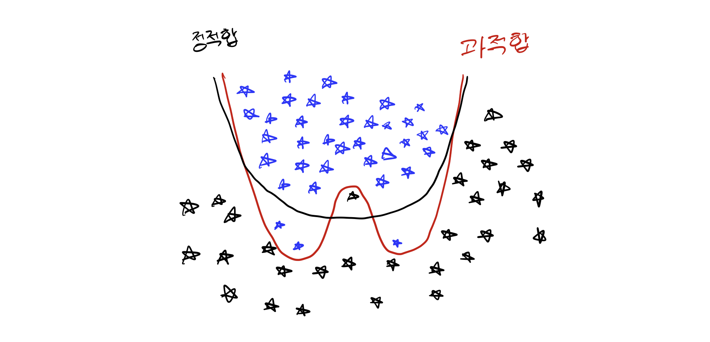

# Machine Learning

기계학습에 대한 간단한 소개.

> ### references 🔗
> [인공지능 튜링테스트에서 딥러닝까지](http://www.yes24.com/Product/Goods/64441172?scode=032&OzSrank=46)   
> [ARTIFICIAL INTELLIGENCE FOUNDATION OF COMPUTER AGENTS](https://nlp.jbnu.ac.kr/AI2019/Cambridge_ArtificialIntelligence.pdf)

## Contents		
* ### [지도학습](#)      
	* ### [분류](#)
* ### [비지도학습](#)
* ### [강화학습](#)

#    

기계학습은 일반적으로 **귀납적 학습**을 통해 문제를 해결한다.

귀납적 학습이란 구체적인 사례들을 일반화하여 일반적인 패턴(모델이라고도 함)을 추출하는 방식이다.

쉽게 말하면 주어진 학습 데이터들을 잘 설명할 수 있는 패턴을 찾는 것이다.

## supervised learning
입력값과 그에 따른 출력값을 가지는 데이터들로부터 **새로운 입력에 대한 출력**을 결정할 수 있는 패턴을 추출한다.

지도학습을 통해 해결할 수 있는 문제

* [분류](#)

## unsupervised learning
출력에 대한 정보가 없는 데이터들로부터 필요한 패턴을 추출한다. 

**입력에 대한 출력을 생성하는 것이 목적이 아니라 전달받은 데이터 자체의 특징을 파악**하는 것이 목적이다.

비지도학습을 통해 해결할 수 있는 문제

* [차원축소](#)
* [이상치 탐지](#)
* [군집화](#)

## reinforcement learning
출력에 대한 정확한 정보를 제공하지는 않지만, 계산한 출력(행동)에 대한 평가정보는 주어지는 문제에 대해 각 상태에서의 행동을 결정한다.

## classification
데이터를 정해진 몇 개의 부류(class)로 대응시킨다.

분류기(classifier)란 학습된 함수를 이용하여 데이터를 분류하는 프로그램이다.

> 학습된 함수는 수학적 함수일 수도 있고 규칙일 수도 있다.     
> ex) 문서의 카테고리를 결정하는 프로그램

* 학습 데이터 : 함수를 만들기 위해 사용되는 데이터
* 검증 데이터 : **학습 과정**에서 사용된다. **학습의 종료시점을 결정**한다.
* 테스트 데이터 : 학습한 모델의 **성능을 평가**하기 위한 데이터 집합. **학습에 사용되지 않은 데이터**. 

### overfitting
과적합이란 학습데이터들에 대해 지나치게 성능이 높은 상태이다. 

학습 데이터에는 오류나 잡음이 포함되어 있을 수 있다.

그래서 학습 데이터에 대해 성능이 좋더라도 학습되지 않은 데이터에 대해 성능이 좋지 않을 수 있다.

> 이상적인 분류기는 학습되지 않은 데이터를 잘 분류해야 한다.

