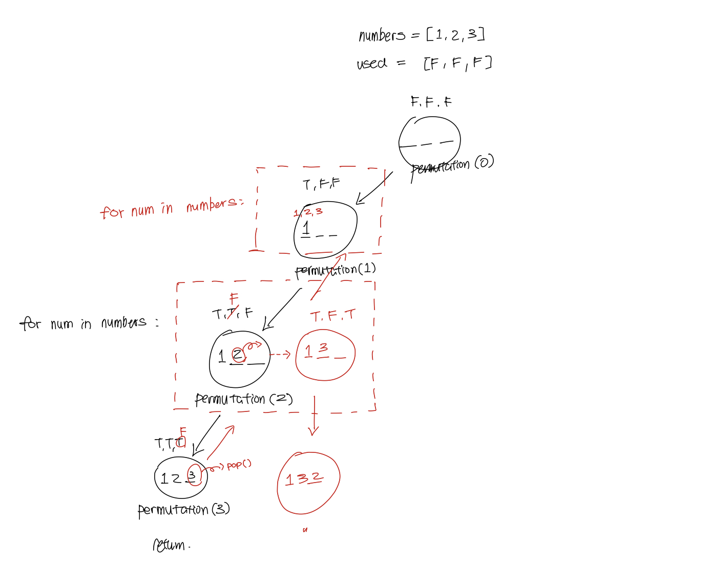
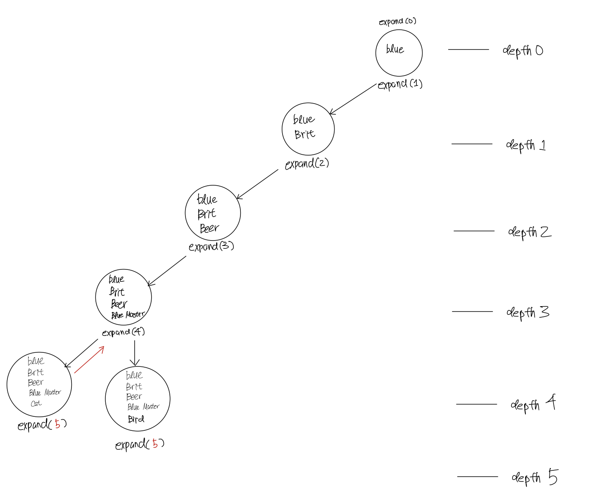
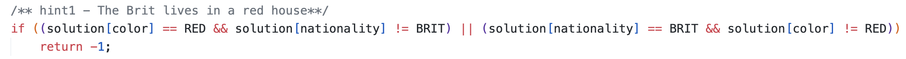
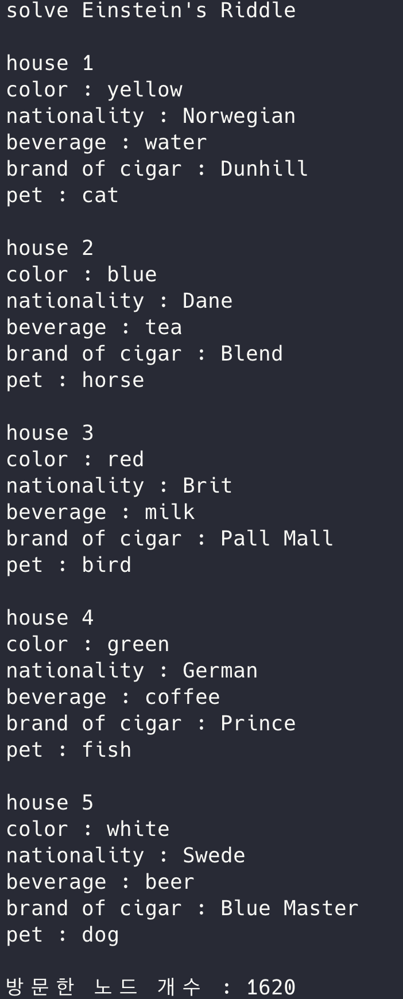

# Einstein's Riddle
백트래킹 알고리즘을 사용한 풀이.

## Contents
* [문제](https://github.com/mingeun2154/CS/tree/main/Algorithm/BackTracking#%EB%AC%B8%EC%A0%9C)
* [설계](https://github.com/mingeun2154/CS/tree/main/Algorithm/BackTracking#%EC%84%A4%EA%B3%84)
* [순열](https://github.com/mingeun2154/CS/tree/main/Algorithm/BackTracking#%EC%88%9C%EC%97%B4)
* [state space 정의](https://github.com/mingeun2154/CS/tree/main/Algorithm/BackTracking#state-space)
* [promising 함수](https://github.com/mingeun2154/CS/tree/main/Algorithm/BackTracking#promising)
* [실행 결과](https://github.com/mingeun2154/CS/tree/main/Algorithm/BackTracking#%EC%8B%A4%ED%96%89-%EA%B2%B0%EA%B3%BC)

## 문제   
다음을 만족하는 다섯 개의 집과 주인에 대한 모든 정보를 구하여라.

```
𝐇𝐢𝐧𝐭𝐬

1.  The Brit lives in a red house.   
2.  The Swede keeps dogs as pets.    
3.  The Dane drinks tea.    
4.  The green house is on the left of the white house (next to it).    
5.  The green house owner drinks coffee.    
6.  The person who smokes Pall Mall rears birds.   
7.  The owner of the yellow house smokes Dunhill.   
8.  The man living in the house right in the center drinks milk.    
9.  The Norwegian lives in the first(leftmost) house.    
10. The man who smokes Blend lives next to the one who keeps cats.     
11. The man who keeps horses lives next to the man who smokes Dunhill.
12. The owner who smokes Blue Master drinks beer.    
13. The German smokes Prince.   
14. The Norwegian lives next to the blue house.     
15. The man who smokes Blend has a neighbor who drinks water.      

각 집의 color, nationality, beverage, brand of cigar, pet은 모두 다르다.
 ```

## 설계   
문제의 조건에 맞는 해답을 다음과 같은 방식으로 모두 출력한다.
```cli
house1
color : red
nationality : Swede
beverage : tea
brand of cigar : Pall Mall
pet : cats

// house2, house3, ...
```

## 순열
### [코드 보기](https://github.com/mingeun2154/CS/blob/main/Algorithm/BackTracking/exercise/combination.py)
(코드에는 1,2,3,4에 대한 순열을 구현하였지만 아래의 설명은 1,2,3에 대한 것임)   

문제를 해결하려면 순열을 구현할 수 있어야 한다.
순열을 백트래킹으로 나타낼 때의 state space tree는 다음과 같다.   
각각의 노드는 배열 solution을 나타낸다. 트리의 depth가 3(정렬하는 숫자의 개수)이 되면 solution의 내용을 출력한다.
이 때 중복을 막기 위해 used 배열을 사용해 특정 원소의 사용 여부를 저장한다.



## state space
    

**각 노드는 집의 특징** 이다.  
노드들은 배열 solution의 원소이며 solution[0~4]는 각각 첫 번째 집의 색, 국적, 음료, 담배 브랜드, 애완동물이다.    

결국 배열에 저장되는 값은 다음과 같다.      

|배열의 원소|내용|
|-------------------------|-------------------|
|solution[0] ~solution[4] |첫 번째 집의 정보  |
|solution[5] ~solution[9] |두 번째 집의 정보  |
|solution[10]~solution[14]|세 번째 집의 정보  |
|solution[15]~solution[19]|네 번째 집의 정보  |
|solution[20]~solution[24]|다섯 번째 집의 정보|

이러한 tree는 expand() 함수에 의해 확장된다.   
expand() 함수는 각 특징들이 중복되지 않도록 노드를 생성한다. used~ 배열을 사용한다.    
promising() 함수에 의해 backtracking되지 않는 full state tree의 노드 개수는 (5!)⁵ 이다.    

## promising
promising() 함수를 사용하여 탐색할 노드의 수를 줄일 수 있다.
이 함수는 [힌트](https://github.com/mingeun2154/EinsteinsRiddle#문제)를 **만족하지 않는(non promising)** 노드를 탐색하지 않도록 유도한다.      
불필요한 노드를 걸러내는 과정은 다음과 같다.
expand() 함수가 노드를 확장하다가 depth%5==0 이면 promising() 함수를 실행하여 결과가 -1이면 더 이상 탐색하지 않고 expand() 함수가 return 된다.     
현재 노드의 depth가 5의 배수일 때마다 이전 5개 노드에 집 한 개에 대한 정보가 저장되기 때문이다.

### 힌트를 if 문으로 나타내기
문제의 **[힌트](https://github.com/mingeun2154/EinsteinsRiddle#문제)들은 모두 a⇄b 형태의 명제** 이다.  
<span style="background-color:#FFE400; border-radius:25px;"> a⇄b ⇔ (a→b)⋀(b→a) 이고 a→b ⇔ \~a∨b 이므로 각각의 힌트는 (\~a∨b)∧(\~b∨a)로 나타낼 수 있다.</span>    
예를 들어'The Brit lives in a red house'라는 조건은 **(Brit ⋀ \~red house)∨(\~Brit ⋀ red house)** 로 표현할 수 있다.    
    


## 실행 결과

