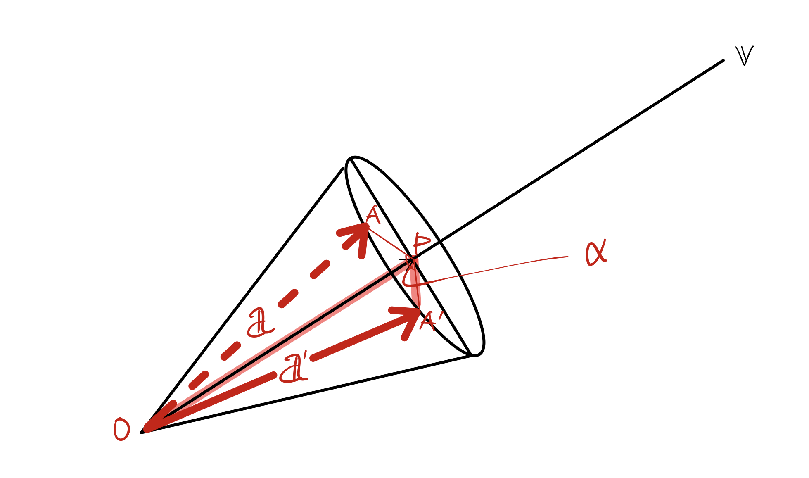

# Transformation

> ### references 🔗 
> Interactive Computer Graphics

## Contents		
* ### [3차원 강체의 방향](https://github.com/mingeun2154/CS/tree/main/CG/Transformation#euler-angles-for-3d-rotations)      
* ### [3차원에서 임의의 축을 기준으로 회전](https://github.com/mingeun2154/CS/tree/main/CG/Transformation#axis-angle-rotation)      
* ### [Dual Matrix](https://github.com/mingeun2154/CS/tree/main/CG/Transformation#dual-matrix)

#    

## Euler Angles for 3D Rotations

Euler Angle이란 3차원에 놓인 rigid body(강체)의 방향을 기술하기 위한 세 개의 각도이다.

이 강체의 방향은 **각 축을 중심으로 세 번 회전**하여 얻을 수 있다.

> 순서대로 벡터를 𝕩, 𝕪, 𝕫축을 중심으로 θ만큼 회전시키는 행렬이다.

𝕫축을 중심으로 회전하는 경우, 𝕩, 𝕪좌는 변하지만 𝕫좌표는 변하지 않는다.

## Axis-Angle Rotation

임의의 축 𝕧를 기준으로 각도 𝕒만큼 회전시키는 행렬 𝐑을 만드는 공식(**로드리게스 회전 공식**)은 다음과 같다.     
> 𝕧는 크기가 1인 벡터이다. 

### 공식 유도

목표는 𝕒에 곱해서 𝕒'가 되도록 만드는 행렬 𝐑을 찾는 것이다.

1. 𝕒' = (벡터 OP) + (벡터 PA')

2. 벡터 OP를 𝕒로 표현
	
	
3. 벡터 PA'를 𝕒로 표현
	
	

	> 평면 V는 위의 원뿔에서 𝕧에 수직한 원뿔의 바닥 평면이다.

	PA' 는 평면 V를 span하는 orthonormal basis인 𝕖1과 𝕖2의 선형결합으로 표현할 수 있게 된다.

	

4. 결론
	
		

	> (𝕧x)는 dual matrix이다.

## Dual Matrix
> skew-symmetric matrix라고도 한다.

𝕧의 dual matrix와 𝕒의 곱은 𝕧x𝕒와 결과가 같다. Dual matrix를 사용하면 **외적을 행렬의 곱으로 표현**할 수 있다.

𝕧=(v1, v2, v3)의 dual matrix는 다음과 같다.

> 🚨 내적도 두 행렬의 곱으로 표현 할 수 있다.     
> 𝕒·𝕧 = trans(𝕒)𝕧 = trans(𝕧)𝕒
