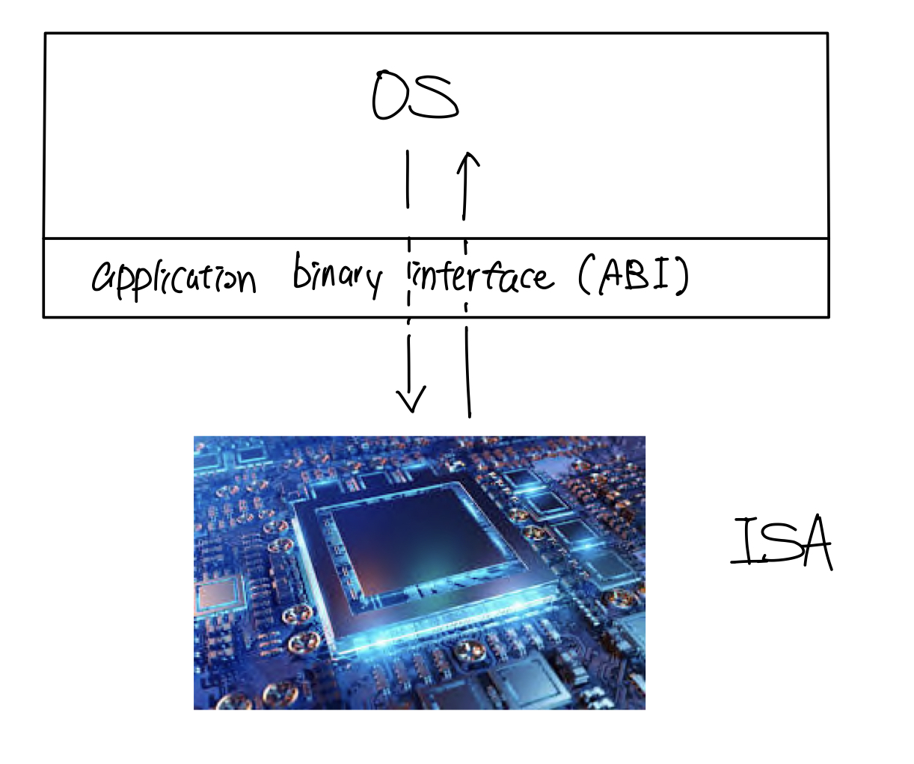
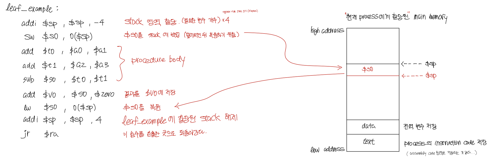
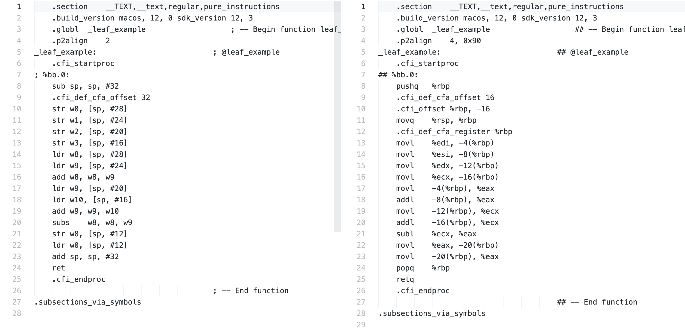
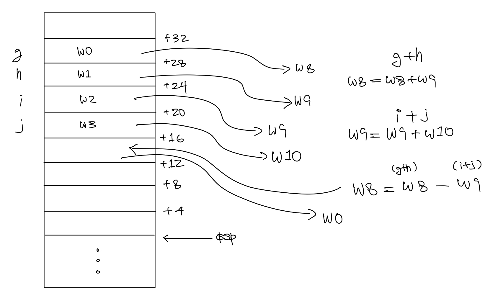

# MIPS Architecture
> 출처   
> Computer Organization And Design 5th Edition    
> Computer Systems : A Programmer's Perspective 3rd Edition

이 글은 Computer Organization ... 책이 default 값이다.

## Contents		
* ### [MIPS란 무엇인가](https://github.com/mingeun2154/CS/tree/main/ComputerArchitecture/MIPS#mips)
* ### [ABI란 무엇인가](https://github.com/mingeun2154/CS/tree/main/ComputerArchitecture/MIPS#abi)      
* ### [Instructions Set](https://github.com/mingeun2154/CS/tree/main/ComputerArchitecture/MIPS#instructions-set)      
* ### [Register Usage](https://github.com/mingeun2154/CS/tree/main/ComputerArchitecture/MIPS#register-usage)      
* ### [함수 호출 과정](https://github.com/mingeun2154/CS/tree/main/ComputerArchitecture/MIPS#procedure-calling)
* ### [Stack Frame](https://github.com/mingeun2154/CS/tree/main/ComputerArchitecture/MIPS#stack-frame)

#    

## MIPS
이 책(Computer Organization ...)에서는 MIPS라는 **ISA**를 선택하여 컴퓨터구조를 설명하고 있다.    
Computer Systems 책에서는 x86-64 architecture를 기준으로 설명하고 있다.

**ISA(Instruction Set Architecture)는 컴퓨터를 추상화한 모델(컴퓨터구조)이다.**    
ISA에 정의된 instruction set을 실행하는 device를 **implementation**이라고 한다. (ex. CPU)      

```
프로그래밍 언어들이 그렇듯, 컴퓨터구조 또한 하나를 알면 나머지는 대동소이하다. 
책의 저자는 프로그래밍 언어들을 지역 방언에 비유했다. 적절한 표현이라고 생각한다.
실제로 ARMv7 은 MIPS와 비슷하며 ARMv7의 메모리 주소를 32 bits에서 64 bits로 확장한 ARMv8은 MIPS와 더 비슷하다.
ARM 프로세서 칩은 2011년에만 90억개 이상이 생산되며 전 세계에서 가장 인기있는 ISA가 되었다.
```

## ABI
**ABI(Application Binary)란 서로 다른 binary code module 사이의 interface이다.**   



**OS 코드는 ABI를 활용하여 ISA의 instruction set으로써 HW를 제어**한다. (ABI는 OS와 ISA를 연결해준다.)    
OS가 특정 ISA에 대한 ABI를 활용한다면 미래의 그 ISA의 implementation에서도 실행된다. => *binary compatibility*    
    
ABI와 API를 비교하면 조금 더 직관적으로 이해할 수 있다.

|API																								   |ABI																																	  |    
|------------------------------------------------------|----------------------------------------------------------------------|    
|HLL로 작성된 소프트웨어 모듈 사이의 인터페이스		     |binary program module 사이의 인터페이스															  |
|HLL에 의해 사용되는 자료구조와 함수를 정의한다			   |machine code에 의해 접근되는 자료 구조와 computational routines을 정의|
|HW에 독립적이다                                       |HW 의존적이다                                                         |

> machine code란 컴퓨터가 이해하는 명령어이다.  0과 1로 이루어진 코드다.   

## instruction set
> 내용이 굉장히 많기 때문에 중요하다고 생각하는 개념들만 정리했다

MIPS는 32×32-bit register file을 가진다. **(4byte register를 32개 가진다.)**     
각각의 register들은 0~31로 indexing되고 32-bit data를 **word**라고 한다.
> 64-bit processor는 register의 크기가 64bit이다.

MIPS instruction에는 **R-Format**, **I-Format**, **J-Format** 세 가지 format이 있다.    
우리가 사용하는 +,/,%,=,if,for 등의 모든 명령어들은 이런 몇 가지 안되는 format의 machine code로 번역되어 CPU에서 실행된다.    
format이란 일종의 규칙이다. 32-bit 숫자들을 어떻게 해석할 것인지에 대한 규칙이다.   
일관성 있는 규칙은 HW 구현을 간단하게 만들고 간단한 구현은 낮은 비용으로도 높은 성능을 달성하게 해준다.

## Register Usage

|레지스터 이름|레지스터 index|역할                          |
|-------------|--------------|------------------------------|
|$a0 ~ $a3    |4 ~ 7         |arguments                     |
|$v0 , $v1    |2 , 3         |result values                 |
|$t0 ~ $t9    |8 ~ 15, 24, 25|temporaries	  	              |
|$s0 ~ $s7    |16 ~ 23       |saved   				              |
|$k0 , $k1    |26 , 27       |reserved for OS               |
|$gp          |28            |global pointer for static data|
|$sp          |29            |stack pointer                 |
|$fp          |30            |frame pointer                 |
|$ra          |31            |return address                |
|$zero        |0             |zero                          |
|$at          |1             |reserved for assembler        |

$t는 덮어써질 수 있는 임시적인 값들을 저장하고 $s의 값들은 덮어써지기 전에 백업되었다가 다시 복원된다.      

## procedure calling
함수의 호출은 **jal** , **jr** instruction에 의해 시작되고 끝난다.    

```MIPS
jal ProcedureLabel
// 호출한 함수가 종료되고 실행할 instruction의 주소를 $ra에 저장한다.
// target address(ProcedureLabel)로 jump

jr $ra
// $ra가 program counter로 복사된다.
// jr instruction은 case, switch statement에도 사용된다.
```

함수를 호출하는 경우는 **두 가지 경우**로 일반화 할 수 있다.     
[Leaf Procedure](https://github.com/mingeun2154/CS/tree/main/ComputerArchitecture/MIPS#leaf-procedure)과 [Nested Procedure](https://github.com/mingeun2154/CS/tree/main/ComputerArchitecture/MIPS#nested-procedure)이다.

### Leaf Procedure

```C
int leaf_example(int g, h, i, j) {
	int f;
	f = (g + h) - (i + j);
	return f;
}	
// arguments g, ..., j in $a0, ..., $a3
// f in $s0 ($s는 stack에 저장되어야 한다.)
// result in $v0
```

위의 C 코드는 아래와 같은 과정을 거친다.   



> $sp는 stack "top" 을 가리킨다. stack읕 주소값이 감소하는 방향으로 증가하기 때문에 가장 아래가 "top"이다.

`$ gcc -S [c 코드] -o [assembly code 파일 이름]`      

로컬에서 컴파일해본 결과 실제로는 아래와 같이 컴파일 되었다.    

  

> 왼쪽은 ARM architecture의 instruction이고 오른쪽은 Rosetta를 거친 intel processor의 instruction이다.   

ARM 아키텍쳐(M1)의 instruction set은  MIPS와 비슷했다. 일단 명령어의 이름부터가 비슷하다.    
	 
M1의 instruction set에서  
**str, ldr, 을 각각 sw, lw** 에 대응시켜보았다. (그림의 직사각형은 메모리의 stack 영역이다.)

   

> M1 이 [leaf_example()](https://github.com/mingeun2154/CS/tree/main/ComputerArchitecture/MIPS#leaf-procedure) 함수를 실행하는 과정    

함수의 인자인 g, h, i, j를 모두 RAM에 저장하고, 다시 꺼내 쓰고 있다. 책의 MIPS에 비해 메모리에 자주 접근하고 있다.

%rsp는 stack pointer, %rbp는 frame pointer이다. x86은 frame pointer와 offset을 조합하여 함수의 지역변수에 접근한다.


> x86_64가 [leaf_example()](https://github.com/mingeun2154/CS/tree/main/ComputerArchitecture/MIPS#leaf-procedure) 함수를 실행하는 과정    
	

* ### Nested Procedure

## Stack Frame
