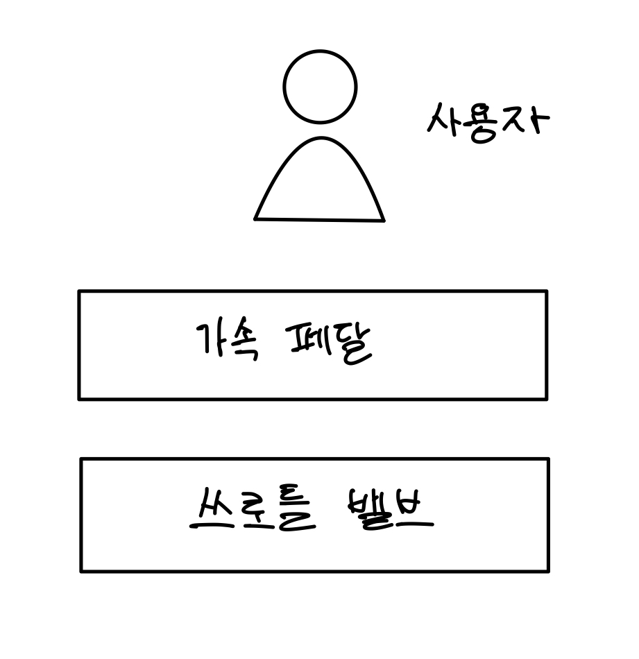

## Eight Gread Ideas in Computer Architecture

컴퓨터 구조를 관통하는 8개의 개념들이다.     
그 중 몇 가지는 컴퓨터 구조 뿐만 아니라 🔥**소프트웨어 개발에도 적용된다**고 생각한다.
> 출처 : Computer Organization And Design 5th Edition -David A. Patterson, John Hennessy-

<br>

### 1. Design for Moore의 법칙
IC 의 성능이 18~24달 마다 2배가 된다. 컴퓨터 디자인은 수 년이 걸릴 수 있기 때문에 그 사이에 IC(반도체)의 성능이 두 배에서 4배까지도 향상될 수 있다.     
때문에 컴퓨터 구조 디자이너들은 컴퓨터 구조가 완성될 때의 IC 성능을 예상하여 설계해야 한다.

### 2. 🔥 Use Abstraction to Simplify Design
> 소프트웨어 설계에도 적용되는 개념이다. 정말 자주 등장한다.

하드웨어와 소프트웨어 개발에 있어서 생산성을 향상시키기 위한 중요한 기술은 **abstraction(추상화)** 이다.   

```
추상화란?
추상화는 사람이 복잡한 개념을 이해하기 위한 과정이다.	
구체적인 여러 대상들로부터 공통점을 뽑아 일반화하고 간단한 논리적인 모델로 재구성한다.  
```
추상화를 통해 디자인을 계층으로 표현할 수 있다.    
**lower-level의 자세한 동작 과정은 숨겨진 채 higher-level에는 간단한 모델로서 정해진 기능을 제공한다.**       

간단하게 자동차의 가속 페달을 예로 들 수 있다.   
가속 페달의 기능은 자동차를 가속하는 것이다. 그렇다면 가속 페달은 어떻게 속도를 높이는 걸까?   
가속 페달은 쓰로틀 벨브의 각도를 조절하여 흡기의 양을 제어하여 속도를 높인다.   
이 과정을 다음과 같이 계층적 구조로 추상화 할 수 있다. 그림속의 네모는 계층을 의미한다.    
<center></center>    

**각 계층은 하위 계층의 작동 원리는 알 필요 없이 제공하는 기능을 사용할 뿐이다.**      
운전자는 페달을 누르고, 페달은 쓰로틀을 조작한다. 사용자가 쓰로틀에 직접 접근할 일은 없다.    

### 3. 🔥 Make the Common Case Fast	
> 소프트웨어를 개발할 때 적용할 수 있다.   

<center></center>

특수한 상황에 대한 최적화보다 **일반적인 케이스**에 대한 처리 속도를 높이는 것이 전체 성능 향상에 도움이 된다.    
컴퓨터 구조적인 관점에서 생각해봤을 때, 특수한 케이스는 결국 조건문을 통해 진입하게 되는데 조건문 자체가 성능을 저하시키는 경향이 있기 때문에 그런것 같다.    
조건문은 pipeline을 통한 병렬처리를 힘들게 한다.  
*위의 사진은 대부분의 이동은 한두명이 일반적이므로, 1,2인승 차를 빠르게 만드는 것이 미니밴을 빠르게 만드는 것보다 쉽고 효과적이라는 의미이다.* 라고 책에 씌여있었다...

### 4. Performance via Parallelism

### 5. Performance via Pipelining

### 6. Performance via Prediction

### 7. 🔥 Hierarchy of Memories

### 8. Dependability via Redundancy
