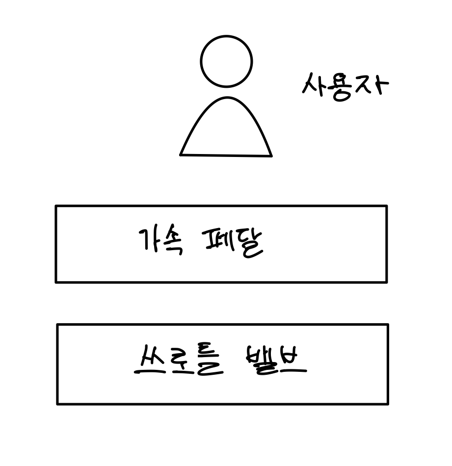
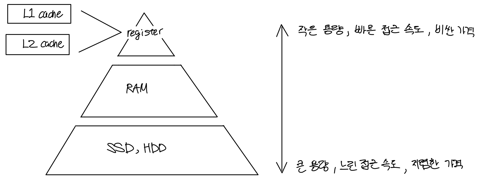

# Eight Great Ideas in Computer Architecture
> 출처 : Computer Organization And Design 5th Edition

컴퓨터 구조를 관통하는 8개의 개념들이며 🔥 표시가 붙은 개념들은 **소프트웨어 개발에도 적용된다.**    
(웹 개발에 직접적인 관련이 없다고 생각한 개념들은 간단히 소개만 하고 넘어갔다.)

## Contents		
* ### [1. Moore's Law](https://github.com/mingeun2154/CS/tree/main/ComputerArchitecture/eightGreatIdea#1-design-for-moore%EC%9D%98-%EB%B2%95%EC%B9%99)      
* ### [2. Abstraction 🔥](https://github.com/mingeun2154/CS/tree/main/ComputerArchitecture/eightGreatIdea#2-use-abstraction-to-simplify-design-)
* ### [3. Make the Comman Case Fast 🔥](https://github.com/mingeun2154/CS/tree/main/ComputerArchitecture/eightGreatIdea#3-make-the-common-case-fast)
* ### [4. Parallelism](https://github.com/mingeun2154/CS/tree/main/ComputerArchitecture/eightGreatIdea#4-performance-via-parallelism)
* ### [5. Pipelining](https://github.com/mingeun2154/CS/tree/main/ComputerArchitecture/eightGreatIdea#5-performance-via-pipelining)
* ### [6. Prediction](https://github.com/mingeun2154/CS/tree/main/ComputerArchitecture/eightGreatIdea#6-performance-via-prediction)
* ### [7. Hierarchy of Memories 🔥](https://github.com/mingeun2154/CS/tree/main/ComputerArchitecture/eightGreatIdea#7-hierarchy-of-memories-)
* ### [8. Dependability via Redundancy](https://github.com/mingeun2154/CS/tree/main/ComputerArchitecture/eightGreatIdea#8-dependability-via-redundancy-1)

#

## 1. Design for Moore's Law
> *누울 자리를 보고 발을 뻗어라*    

IC 의 성능이 18~24달 마다 2배가 된다. 컴퓨터 디자인은 수 년이 걸릴 수 있기 때문에 그 사이에 IC(반도체)의 성능이 두 배에서 4배까지도 향상될 수 있다.     
때문에 컴퓨터 구조 디자이너들은 **컴퓨터 구조가 완성되어 사용될  때의 IC 성능을 예상**하여 설계해야 한다.

## 2. Use Abstraction to Simplify Design 🔥
하드웨어와 소프트웨어 개발에 있어서 생산성을 향상시키기 위한 중요한 기술은 **abstraction(추상화)** 이다.   

```
추상화란?
추상화는 사람이 복잡한 개념을 이해하기 위한 과정이다.	
구체적인 여러 대상들로부터 공통점을 뽑아 일반화하고 간단한 논리적인 모델로 재구성한다.  
```
추상화를 통해 디자인을 계층으로 표현할 수 있다.    
**lower-level의 자세한 동작 과정은 숨겨진 채 higher-level에는 간단한 모델로서 정해진 기능을 제공한다.**       

간단하게 자동차의 가속 페달을 예로 들 수 있다.   
가속 페달의 기능은 자동차를 가속하는 것이다. 그렇다면 가속 페달은 어떻게 속도를 높이는 걸까?   
가속 페달은 쓰로틀 벨브의 각도를 조절하여 흡기의 양을 제어하여 속도를 높인다.   
이 과정을 다음과 같이 계층적 구조로 추상화 할 수 있다. 그림속의 네모는 계층을 의미한다.    
<center></center>    

**각 계층은 하위 계층의 작동 원리는 알 필요 없이 제공하는 기능을 사용할 뿐이다.**      
운전자는 페달을 누르고, 페달은 쓰로틀을 조작한다. 사용자가 쓰로틀에 직접 접근할 일은 없다.    

## 3. Make the Common Case Fast	🔥
<center></center>

특수한 상황에 대한 최적화보다 **일반적인 케이스**에 대한 처리 속도를 높이는 것이 전체 성능 향상에 도움이 된다.    
컴퓨터 구조적인 관점에서 생각해봤을 때, 특수한 케이스는 결국 조건문을 통해 진입하게 되는데 조건문 자체가 성능을 저하시키는 경향이 있기 때문에 그런것 같다.    
조건문은 pipeline을 통한 병렬처리를 힘들게 한다.  
*위의 사진은 대부분의 이동은 한두명이 일반적이므로, 1,2인승 차를 빠르게 만드는 것이 미니밴을 빠르게 만드는 것보다 쉽고 효과적이라는 의미이다.* 라고 책에 씌여있었다...

## 4. Performance via Parallelism
Parallelism(병렬성)를 통해 throughput을 증가시켜 성능을 향상시킬 수 있다.    
Throughput이란 단위시간당 처리하는 작업의 양이다.

## 5. Performance via Pipelining
Parallelism을 구현하는 대표적인 방식이다. 

## 6. Performance via Prediction
> *고민보다 go*

결과와 방법에 대한 확신이 들 때까지 고민하다가 시작하기보다 결과를 대충 예상(guessing)하고 **일단 시작**하는 것이 더 빠른 경우가 있다.    
단, 추측이 틀렸을 경우 회복하는데 필요한 cost가 너무 크지 않고 예측이 비교적 정확해야 한다.

## 7. Hierarchy of Memories 🔥
프로그래머들은**빠르고, 용량이 크고 저렴한 메모리**를 원한다.     
일반적으로 메모리의 속도가 시스템의 성능을 결정하고, 메모리의 가격은 컴퓨터 전체의 가격 중 큰 비중을 차지하기 때문이다.    
이런 상충되는 요구를 만족시키기 위한 개념이 바로 **hierarchy of memoris (계층적 메모리 구조)** 이다.   



caching 기법을 통해 사용자는 main memory가 상위 계층 메모리만큼 빠르고, 하위 계층 메모리만큼 크다고 느끼게 된다.      
계속해서 사용자가 **접근할 것 같은 data를 미리 main memory에서 상위 계층 메모리로 올려**두면    
사용자는 **main memory의 data를 상위 계층 메모리의 속도로 접근**할 수 있고     
**main memory는 사용자가 접근할 것 같은 data 를 미리 하위 계층(disk)로부터 가져**오기 때문이다.   
> **caching**이란 자주 사용되는 data를 접근 속도가 상대적으로 빠른 상위계층의 메모리에 저장해놓고 사용하는 기법으로,    
> 자주 쓰는 핸드폰, 지갑은 빨리 )꺼내 쓰고 넣기 위해 주머니(상위 계층)에 넣고, 가끔 꺼내는 책, 노트북 등은 가방(하위 계층)에 넣는 것과 같은 원리이다.

**사용자가 접근할 것 같은 data**는 운영체제가 [다양한 알고리즘](#)을 통해 판단한다.

## 8. Dependability via Redundancy
컴퓨터는 빠를 뿐만 아니라 계산 결과가 신뢰할 수 있어야 한다(dependable).    
물리적인 장치들은 고장(fail)이 날 수 있기 때문에 시스템은 특정 장치의 고장을 인식하고 그 작업을 넘겨받아 진행할 **redundant component**를 가진다.
