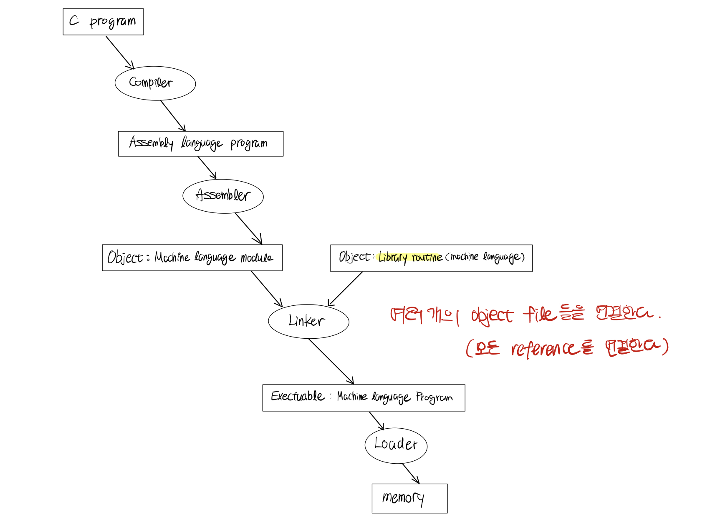

# Translating and Starting a Program

> ### references 🔗
> Computer Organization and Design 5th Edition    

**파일(disk에 존재)로 이루어진 C 프로그램이 실행가능한 프로그램이 되는 과정**은 크게 **네 단계**로 나눌 수 있다.

각 파일의 확장자(extension)
* assembly file : `*.s`
* object file : `*.o`
* statically linked library : `*.a`
* dynamically linked library : `.so`
 > macOS에서는 \*.dylib
* executable file : `*.out`

file extension은 사람과 OS위에서 돌아가는 프로그램들(compiler, editor, 등 )을 위한 것이다. Unix System은 모두 regular file로 인식한다.

## Contents		
* ### [Compiler](https://github.com/mingeun2154/CS/tree/main/ComputerArchitecture/translate-start#compiler-1)
* ### [Assembler](https://github.com/mingeun2154/CS/tree/main/ComputerArchitecture/translate-start#assembler-1)
* ### [Linker](https://github.com/mingeun2154/CS/tree/main/ComputerArchitecture/translate-start#linker-1)
* ### [Dynamically Linked Libraries](https://github.com/mingeun2154/CS/tree/main/ComputerArchitecture/translate-start#dynamically-linked-libraries-1)

#    

## Compiler
C program을 **assembly language program**으로 번역한다. assembly language program은 기계가 이해하는 symbol들로 표현되어 있다.

Assembly language란 binary machine language로 번역될 수 있는 symbolic language이다.

**Assembly language는 machine code(기계가 이해하는 binary code)를 사람이 이해할 수 있도록 symbol(문자)을 이용해 표현한 것이다.**

## Assembler
Assembly language를 machine language module로 번역한다.

assembly language는 higher-level software(C/C++, Java)가 사용하는 인터페이스이다. assembler는 기계어의 **여러 일반적인 variation**을 그 자체로 instruction인 것 처럼 실행할 수 있다.

이런 variation을 **pseudoinstruction**이라고 한다. machine language instruction 여러 개를 묶어 하나의 기능을 실행하는 instruction이다.

`move $t0, $t1` 과 같은 intruction은 실제로 MIPS architecture에 존재하지 않지만 MIPS assembler는 이 명령어를 다음과 같이 변환한다.

`add $t0, $zero, $t1`

Assembler는 다양한 진법의 수를 사용 할 수 있다. 일반적으로 이진법보다 간결하고 bit pattern으로 변환하기 쉬운 진법을 사용한다.
MIPS assembler들은 16진법을 사용한다.

Assembler의 목적은 **assemlby를 machine code**로 변환하는 것이다. (어셈블리 파일을 오브젝트 파일로 변환)

**object file**은 machine language **instructions, data, 명령어를 메모리에 적재하는데 필요한 정보**들의 집합이다.

instruction을 binary 형태로 변환하려면 assembler는 instruction에 사용된 **label들의 주소를 결정**해야 한다.
> 이 때, 외부 파일에서 정의된 symbol들에 대한 참조는 주소가 결정되지 못한다.

Assembler들은 **symbol table**을 사용해 모든 label을 관리하는데, 이 테이블에는 (symbol, address) pair가 저장되어 있다.

UNIX system 오브젝트 파일은 여섯 부분으로 나눠진다.
* object file header : 다른 부분들의 크기와 위치를 설명한다.
* text segment : machine language code
* static data segment, dynamic data segment : 프로그램이 시작될 때부터 종료될 때까지 할당되는 변수와 런타임에 할당되고 삭제되는 변수들
* relocation information : linker에게 필요한 정보들. 외부 라이브러리, 헤더 파일 등에 선언된 symbol에 접근하는 과정과 관련이 있다.
* symbol table : external reference같이 **아직 결정되지 않은 label**이 포함된다.
* debugging information : debugger를 위한 정보.

## Linker
> link editor라고도 한다.
프로그램을 여러 모듈로 분리하면 변화가 생긴 부분만 다시 compile, assembling 할 수 있게 된다.

**독립적으로 assemble된 machine language 프로그램들을 이어 붙인다.**

linker는 **세 단계**를 거친다.

* 오브젝트 파일들의 코드와 데이터들을 symbol을 사용해 메모리에 올린다.
* 데이터와 명령어(instruction) label의 주소를 결정한다.
* internal, external reference들을 붙인다.

linker는 각 object file들의 relocation information과 symbol table을 참고하여 **undefined label(아직 주소가 결정되지 않은 symbol)을 해결(resolve)한다.**

즉, linker가 하는 일은 old address를 찾아 new address로 대체하는 것이다.

모든 external reference들이 해결되면(주소가 결정되면) 각 오브젝트 파일들이 **메모리에서 점유할 위치를 결정한다.**

linker는 결론적으로 **executable file**을 생성한다. 일반적으로 이 파일은 **오브젝트 파일과 형식이 똑같다. 단, executable file에는 unresolved reference가 없다.**
> 오브젝트 파일처럼 6개의 부분으로 구성된다.     
> stripped executable file에는 symbol table과 debugging information이 없다.    

## Dynamically Linked Libraries
전통적인 방식은 프로그램이 실행되기 전에 라이브러리릉 linking(reference 주소를 결정)한다. 이 방식은 다음과 같은 **단점**을 가진다.

* 라이브러리가 실행 코드의 일부가 된다. 라이브러리가 개선되더라도 실행 코드에는 반영할 수 없다.
* 라이브러리에 사용하지 않는 함수가 있어도 라이브러리 전체를 메모리에 적재한다. 라이브러리가 큰 경우 오버헤드가 된다.

DLLs는 프로그램이 실행되는동안 동적으로 link되는 라이브러리이다.
