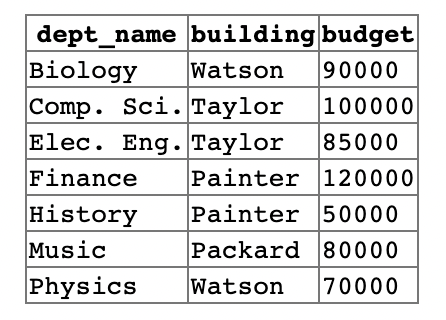

# 관계형 데이터베이스(Relational DataBase)

> ### references 🔗   
> DATABASE SYSTEM CONCEPTS ⛵️ 7th edition

## Contents		

* ### [관계형 데이터베이스의 구조](#)      
* ### [데이터베이스 스키마](#)
* ### [키](#)

#    

## Structure
관계형 데이터베이스는 **테이블**(table)의 모임으로 구성된다. 

일반적으로 테이블의 각 행은 일련의 값 사이의 관계(relationship)를 표현한다.

관계형 모델에서 **릴레이션**(relation)은 테이블을 의미하고 **튜플**(tuple)은 테이블의 행(row)를 의미한다.
> 릴레이션은 튜플의 **집합**이기 때문에 튜플의 순서는 상관이 없다.  

**속성**(attribute)는 열(column을 의미한다.)

* domain - 각 attribute가 가질 수 있는 값들의 집합

* nulll value - 알려지지 않았거나 존재하지 않는 값을 의미한다.

## Schema
* 릴레이션 - 변수
* 스키마 - 타입 정의
* 인스턴스 - 값

         

이 릴레이션의 스키마는 다음과 같다.

**department(dept_name, building, budget)**

## Key
주어진 릴레이션 안에서 튜플을 구별하는 방법.

* superkey - 튜플을 유일하게 식별하는 하나 또는 그 이상의 속성들의 집합. 필요하지 않은 속성이 있을 수 있다.

* candidate key(후보 키) - 최소한의 superkey.

* primary key(주 키) - 릴레이션 안에서 튜플을 구별하기 위한 수단으로 DB 설계자에 의해 선택된 후보 키.
