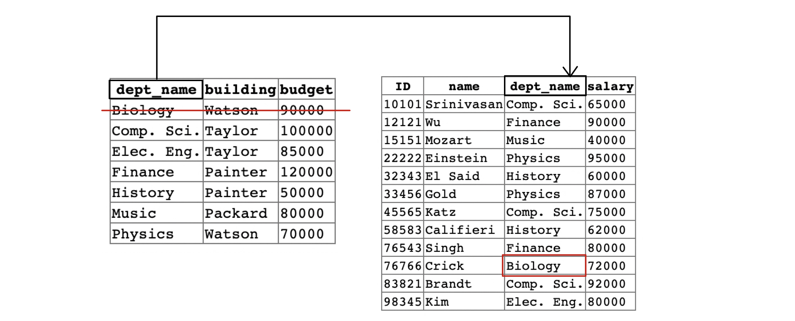

# SQL

> ### references 🔗   
> DATABASE SYSTEM CONCEPTS ⛵️ 7th edition

## Contents		
* [구성요소](https://github.com/mingeun2154/CS/tree/main/DB/SQL#composition)
* [기본 타입](https://github.com/mingeun2154/CS/tree/main/DB/SQL#data-types)
* [기본 스키마 정의](https://github.com/mingeun2154/CS/tree/main/DB/SQL#define-schema)	
* [무결성 제약 조건](https://github.com/mingeun2154/CS/tree/main/DB/SQL#integrity-constraint)
* [여러 가지 연산](https://github.com/mingeun2154/CS/tree/main/DB/SQL#operations)

#    

IBM에서 1970년대 초반 System R 프로젝트의 일부분으로 초기에 Sequel이라 불리는 SQL의 초기 버전을 개발했다. 그리고 계속 발전하다가 SQL(Structured Query Language)로 이름이 바뀌었다.

1986년에 ANSI와 ISO에서 SQL-86이라고 불리는 SQL 표준을 발표했다. 그 뒤로도 계속 확장되어 SQL:2016까지 발표되었다.

SQL instruction은 대소문자를 구별하지 않는다.

SQL 표준은 문자열에 대한 등호 연산에서 대소 문자를 구별한다고 명시하지만, mysql, sql server등 일부 DBMS는 문자열을 비교할 때 대소 문자를 구별하지 않는다.

## Composition
SQL 언어는 다음과 같은 여러 부분으로 구성되어 있다.

> Query는 원래 SQL의 DML중에서도 정보를 조회하는 명령어를 뜻하지만 SQL 명령어 전체를 뜻하기도 한다.
    

* 데이터 정의 언어(DDL) : **릴레이션 스키마를 정의, 삭제, 수정**하는 명령어
	* 무결성(Integrity) : 데이터베이스에 저장될 데이터가 반드시 만족해야 하는 무결성 제약 조건을 명시한다. 무결성 제약 조건을 위반하는 갱신은 적용되지 않는다.
	* 뷰 정의 : view를 정의할 수 있는 명렁어
	* 권한 부여(Authorization) : 릴레이션과 뷰에 접근할 권한을 부여한다.
* 데이터 조작 언어(DML) : 정보를 찾기 위해 **쿼리**를 요청하고 **튜플을 삽입, 삭제, 수정**한다.
* 트랜잭션 제어 : 트랜잭션의 시작과 끝을 명시하는 명령어를 포함한다.
* 내장(Embedded) SQL과 동적(Dynamic) SQL : 범용 프로그래밍 언어(C/C++, Java, 등)에 내장되어 사용된다.

## Data Types
SQL 표준은 다음의 다양한 내장 타입을 지원한다.

* char(n) : 길이 n을 가지는 고정 길이 문자. n보다 짧은 문자열이 입력되면 **남은 공간이 공백**으로 채워진다.
* varchar(n) : 최대 길이 n을 갖는 가변 길이 문자.
* int : 정수(시스템에 따라 범위가 달라진다.) 
* smallint : 작은 정수(mysql 기준 -32769 ~ 32767)
* numeric(p,d) : 고정 소수점 수. p개의 숫자 및 부호, p개 중 d개는 소수점 이하에 존재하는 숫자의 개수. numeric(3,1)로 지정된 속성은 44.5를 정확히 저장하지만 444.5는 오차가 발생한다.
* real : 시스템에 따라 달라지는 정밀도를 가지는 부동 소수점 수 
* double precision : 시스템에 따라 달라지는 정밀도를 가진다. 정밀도가 두 배인 부동 소수점 수.
* float(n) : 적어도 n개의 숫자로 나타낼 수 있는 정밀도를 갖는 부동 소수점 수

> 소수는 웬만하면 사용하지 말자. [컴퓨터는 실수를 정확히 표현 할 수 없기 때문](#)이다.

`varchar` 타입과 `char` 타입의 비교는 DBMS에 따라 달라지기 때문에 섞어서 사용하지 않는 것이 좋다.

## Define Schema

* `create table r` : 테이블 생성.
* `drop table r` : [테이블 삭제](https://www.youtube.com/watch?v=SWZcrdmmLEU).
* `delete table r` : 릴레이션 r은 남겨두고 튜플만 제거한다.
* `alter table r add A D` : 속성 A 추가. 모든 튜플의 새로운 속성값으로 null이 할당된다.

```SQL 
CREATE TABLE department
	(dept_name varchar(20), 
	 building varchar(15),
	 budget numeric(12,2)
	 primary key (dept_name));
```

## Integrity constraint
무결성 제약 조건은 권한이 주어진 사용자로부터의 데이터베이스 변경이 데이터 **일관성에 손실을 초래하지 않음을 보장**한다.

**우발적 손상**으로부터 데이터베이스를 보호한다.

데이터가 표현하는 현실에 존재하는 대상의 특징, 대상들간의 관계를 표현한다.

보통 스키마 설계 과정의 일부로 인식되지만 이미 존재하는 릴레이션에 추가할 수도 있다.

### not null

```SQL 
name varchar(20) not null
```
해당 속성에 null이 삽입되는 것을 막는다. null을 삽입하려고 하면 오류 메세지를 발생시킨다.

### unique
```SQL 
unique(A1, A2, A3, ... , An)
```

속성 A1, A2, A3, ... , An이 superkey임을 나타낸다. 즉 릴레이션의 어떠한 두 개의 튜플도 나열된 속성의 값이 같을 수 없다.
> null은 어떤 값과도 같지 않다.

### check(<verb>)
명시된 조건을 만족하는 것을 보장한다.
```SQL
create table		 section
	(course_id		 varchar(8),
	 sec_id				 varchar(6),
	 semester			 varchar(6),
	 year					 numeric(4,0),
	 building			 varchar(15),
	 room_number	 varchar(7),
	 time_slot_id  varchar(4),
	 primary key(course_id, sec_id, semester, year),
	 check(semester in ('Fall', 'Winter', 'Spring', 'Summer'))
```
check statement는 `false`가 아니면 만족했다고 판단하므로 `unknown`으로 평가되는 것은 위반이 아니다.

null이 삽입되는 것을 막으려면 not null을 붙여줘야 한다. null과 다른 타입의 값을 비교하면 결과가 unknown이 나온다.

### referential constraint
한 릴레이션(참조하는 릴레이션)의 특정 속성값이 다른 릴레이션(참조되는 릴레이션)의 특정 속성에서 반드시 나타나야 한다.

**foreign key**(외래 키)는 참조된 속성이 참조된 릴레이션의 주 키를 이루는 참조 무결성 제약의 한 형태이다.

기본적으로 외래 키는 참조되는 테이블의 PK 속성을 참조한다.

```SQL
foreign key (dept_name) references department
```

일부 시스템, 특히 mysql은 참조된 릴레이션의 속성을 명시적으로 지정해야 한다.

```SQL
foreign key (dept_name) references department(dept_name)
```

속성이 외래 키를 **형성**하도록 선언할 수도 있다. 단, 외래 키는 참조하는 릴레이션의 PK와 속성 수, 데이터 타입이 일치해야 한다.

```SQL
dept_name varchar(20) references department
```

참조 무결성 제약 조건이 위반되었을 때 기본적인 절차는 위반을 유발한 동작을 거절하는 것이다.(갱신을 수행하는 트랜잭션이 롤백된다.)

하지만 **foreign key** 절은 참조되는 릴레이션의 갱신 동작으로 인해 제약 조건이 위배되어도 그 갱신 동작을 거부하지 않는다. 대신 참조되는 릴레이션의 튜플을 복원 할 수 있는 절차를 저장한다. 



> 좌) departmen	우)instructor

```SQL
delete from department where dept_name='Biology';
```

위의 명령어를 실행할 경우 참조 무결성 제약 조건이 깨지게 된다. 

instructor 릴레이션이 참조하는 값인 'Biology'가 department 릴레이션에 등장하지 않기 때문이다.

**foreign key** 선언에 의해 제약 조건이 위배되지만 해당 수정은 **거절되지 않고 DB에 반영**된다.

외래 키를 선언할 때 `on delete`, `on update`를 사용해 **제약 조건이 위배되는 경우에 대한 대응**을 지정할 수 있다.

```SQL
create table course
	(...
	foreign key(dept_name) references department
								on delete cascade
								on update cascade,
	...);
```

참조되던 값이 삭제, 수정될 경우 참조하는 튜플의 값도 똑같이 삭제되거나 수정된다.

여러 릴레이션에 걸친 외래 키 종속에 대한 연결이 존재할 경우, 전체 연결에 걸쳐 전파된다. 하지만 일련의 갱신이 복구할 수 없는 제약 조건 위반을 발생시킨다면 시스템은 트랜잭션을 취소한다.

`cascade` 대신 `set null`을 사용하면 참조하는 필드가 null이 되고 `set default`를 사용하면 도메인에 대한 기본값이 대입된다.

### 제약 조건 이름 붙이기
무결성 제약 조건에 이름을 붙여줄 수 있다. 나중에 제약 조건을 삭제하기 쉽다.

```SQL 
// constraint <제약 조건 이름> <제약 조건>
salary numeric(8,2), constraint minsalary check (salary > 29000),
// 제약 조건 삭제
alter table instructor drop constraint minsalary;
```

## Operations
### 문자열 연산

