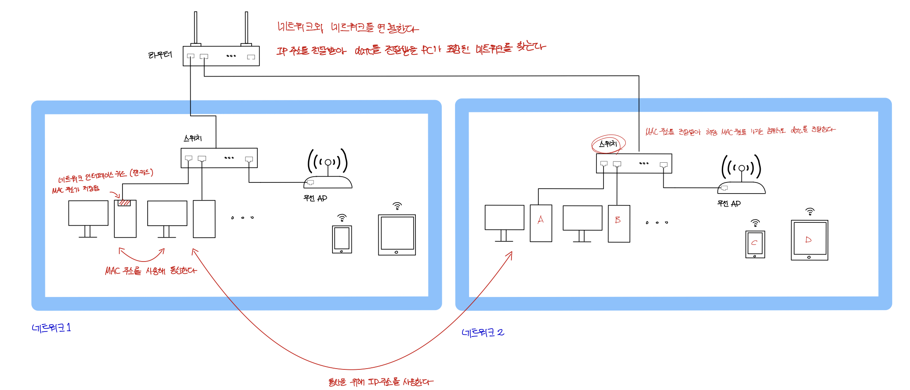
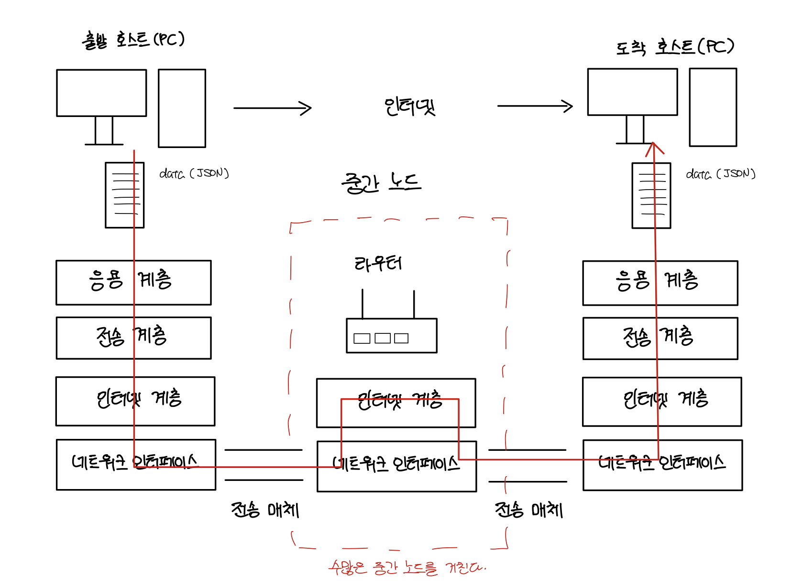
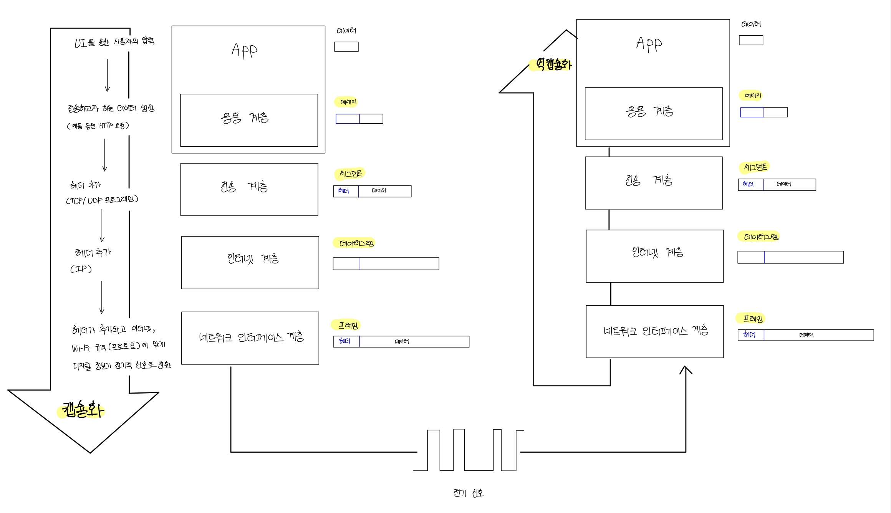
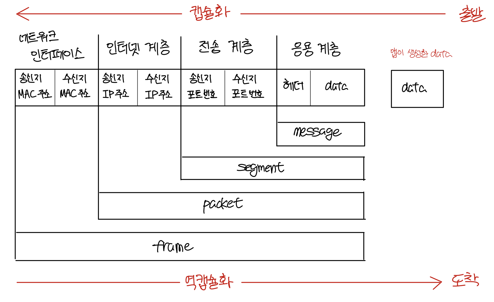

# Internet

> ### references 🔗   
> https://better-together.tistory.com

## Contents		
* ### [인터넷의 구조](https://github.com/mingeun2154/CS/tree/main/Network/Internet#internet-1)
* ### [캡슐화와 역캡슐화](https://github.com/mingeun2154/CS/tree/main/Network/Internet#encapsulation-and-decapsulation)      

#    

## Internet
인터넷은 **TCP/IP 모델**을 따르는 거대한 네트워크이다.

데이터 전송을 담당하는 3개의 계층들(네트워크 인터페이스, 인터넷, 전송)은 데이터의 송수신지를 식별하는 **주소**가 필요하다.

|데이터 전송 담당 계층|기능                                             |식별 주소          |
|---------------------|-------------------------------------------------|-------------------|
|전송 계층                |수신지(PC)에 도착한 데이터를 적절한 앱에 전달    |포트(Port) 번호    |
|인터넷 계층              |**서로 다른 네트워크**에 있는 PC 간의 데이터 전송    |IP 주소(논리 주소) |
|네트워크 인터페이스 계층|**같은 네트워크** 안에서 인접한 장비 간의 데이터 전송|MAC 주소(물리 주소)|

### 스위치 
- 전달받은 MAC주소를 가지는 PC로 데이터를 전송한다.
> MAC주소는 정확히 대응되는 실체(PC)가 있다.
- 단위 네트워크를 형성한다.
- 스위치로 연결된 같은 네트워크에 존재하는 기기들(A,B,C,D)끼리는 **네트워크 계층의 기능**만으로 통신이 가능하다.

### 라우터 
- 스위치로 연결된 단위 네트워크들에 부여된 IP주소를 사용해 data를 전달받을 PC의 위치를 찾는다.     
> IP주소는 네트워크에 부여된 가상의 주소이다. 논리적이기 때문에 대응되는 실체가 없다.    
- 네트워크와 네트워크를 연결한다.

TCP/IP 기반 데이터 통신은 각 계층들이 인접한 계층들과 데이터를 주고 받으며 진행된다.

> 인터넷에 연결된 두 호스트가 데이터를 주고받는 과정

## Encapsulation and Decapsulation
각 계층은 맡은 역할에 따라 프로토콜을 처리하고 데이터에 **헤더(header)**라는 정보를 붙여 다음 계층으로 전달한다.

헤더는 **수신 호스트의 대응되는 계층에서 데이터를 처리할 때 필요한 정보**를 담고 있다.

계층을 지날 때마다 해당 계층의 프로토콜을 처리하고 데이터에 헤더를 추가하는 것을 **capsulation**(캡슐화)라고 한다.

**decapsulation**(역캡슐화)는 데이터의 헤더를 읽고 처리하는 과정(캡슐화의 반대)이다.

> TCP/IP에서의 캡슐화와 역캡슐화

헤더에는 특정 계층의 프로토콜이 필요로 하는 정보가 담겨있다.

송신 호스트의 계층A에서 추가된 헤더를 수신 호스트의 계층A가 그 헤더를 사용하여 데이터를 처리함으로써 **동일한 프로토콜이 구현**된다.

> 헤더에 포함된 정보
