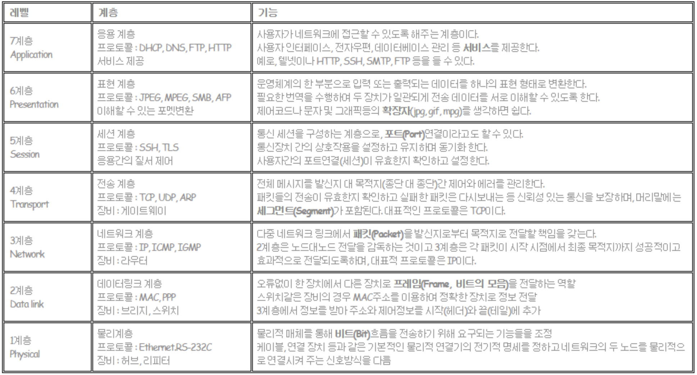
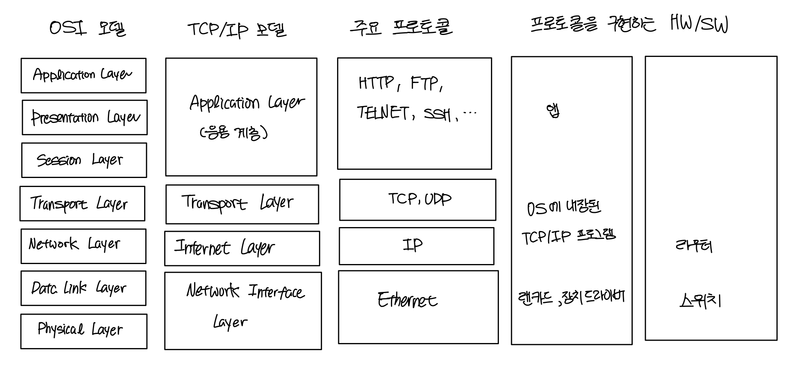
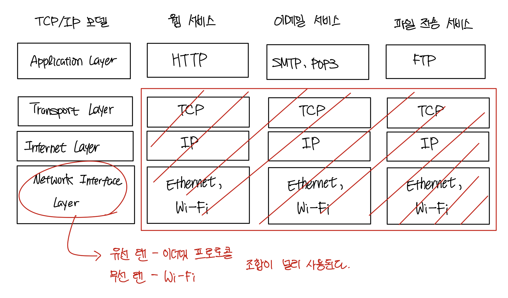

# OSI and TCP/IP

> ### references 🔗
> https://better-together.tistory.com/70?category=887984

## Contents		
* ### [네트워크](#)
* ### [프로토콜](#)
* ### [OSI 모델](#)      
* ### [TCP/IP 모델](#)      

#    

## Network
**여러 개의 host(PC)를 연결**하는 하나의 시스템이다. 연결된 호스트끼리 데이터를 주고받을 수 있다.

네트워크는 수많은 컴퓨터와 네트워크 장비들이 연결되어 데이터를 주고받는 복잡한 시스템이다.

데이터가 전송되는 과정을 논리적인 단계로 분할하여 각 단계에세 핵심 기능을 뽑아내 계층적 구조로 표현한것이 **network architecture**이다.

network archecture에는 대표적으로 **OSI 7-Layer**와 **TCP/IP** 모델이 있다.

## Protocol
컴퓨터 사이에 데이터를 어떻게 주고 받을 것인지를 정의한 **통신규약**이다.

프로토콜의 주요 3요소
* syntax(구문) : 데이터 구조 또는 형식 - **무엇을**
* semantics(의미) : 전송 및 오류 처리 등을 위한 제어 정보 - **어떻게**
* timing(타이밍) : 데이터의 전송 속도 및 순서 - **언제**

컴퓨터끼리 데이터를 전송할 때에는 다양한 프로토콜 중 데이터의 전송 목적, 즉 서비스의 종류에 따라 **프로토콜을 조합**하여 사용한다.

예를 들어 인터넷을 통해 웹 페이지를 주고받는 웹 서비스는 TCP, IP, HTTP를 조합한다.

## OSI 7-Layer
네트웨크에서 통신이 일어나는 과정을 7개의 단계(layer)로 추상화한 모델이다.

**각 계층은 프로토콜에 의해 구현된다.**

국제표준화기구(ISO)에 의해 1984년에 만들어졌다. 구조가 복잡해 널리 보급되지 못하고 실무에서 사용되지 않았다.

그래도 네트워크 통신과정을 개념적으로 설명하는 용도로 활용되고 있다.

현재는 데이터 전송 과정을 4개의 계층으로 단순화한 **TCP/IP모델이 사실상 표준**이다.

> 각 계층에는 역할에 따라 다양한 프로토콜이 존재한다.

## TCP/IP 
network architecture는 프로토콜의 집합이다. 각 계층의 핵심 기능을 정의한 것이 프로토콜이다. 

TCP/IP 모델은 데이터 전송 과정을 4개의 계층으로 단순화하였다. 다양한 네트워크 기술이 TCP/IP를 따른다.

* 응용 계층 : 데이터를 앱에 전달한다. **서비스의 내용에 따라 결정**된다.
* 전송 계층 : 데이터의 흐름을 제어하여 신뢰성, 효율성을 관리하고 목적지 컴퓨터에 도착한 데이터를 **적절한 애플리케이션에 배분**
* 인터넷 계층 : **서로 다른 네트워크**에 있는 컴퓨터 간에 데이터를 전송한다.
* 네트워크 인터페이스 계층 : **같은 네트워크 안**에서 물리적으로 인접한 네트워크 장비 간의 데이터 전송.

###     

**전송 계층, 인터넷 계층, 네트워크 인터페이스 계층의 프로토콜은 고정되어있고 서비스에 따라 응용 계층이 변한다.**

새로운 서비스(앱)를 개발할 때 중요한 것은 응용계층에서 사용할 프로토콜이다. 

**기존에 없던 기능이 필요할 경우, 프로토콜까지 새로 만들어야 한다.**

> 카카오톡은 서비스를 개발할 때 LOCO라는 새로운 프로토콜을 개발했다.
